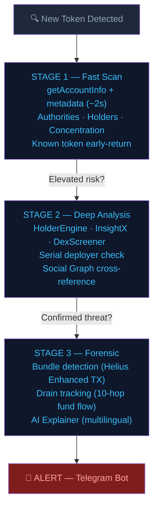
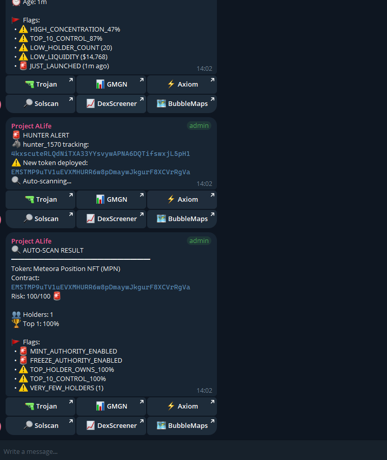

# SolSentry 🛡️
### Solana's Threat Intelligence Graph — Autonomous Operator-Level Detection

> **"RugCheck tells you a fire is burning. SolSentry tells you who lit it — and where they're going next."**

SolSentry is an autonomous threat intelligence system for Solana that tracks **operators**, not just tokens.
While existing tools analyze each token or wallet in isolation, SolSentry maps the people behind the scams — across deployments, across wallets, over time.

🔗 **Telegram:** [t.me/solsentryai](https://t.me/solsentryai)
🔗 **X/Twitter:** [@solsentryai](https://x.com/solsentryai)
🔗 **Live API:** [api.solsentry.app](https://api.solsentry.app/v1/stats)
🔗 **Hackathon:** Colosseum Frontier (April–May 2026)

---

## The Problem

Serial scam operators on Solana deploy dozens of rug pulls using different wallets, rotating bot clusters, and paid KOL networks. Each new token looks clean on launch.

Existing tools analyze tokens in isolation — RugCheck flags insider holders within a single token. SolScanner maps wallet connections when you ask. ChainAware scores individual wallet fraud probability. But nobody connects a serial deployer's latest token to their previous attacks.

The gap isn't token-level detection — it's **cross-attack operator intelligence**.

---

## How It Works



---

## Integrate in 30 seconds

The REST API is live at `api.solsentry.app`. No install required:

```bash
# Is this token risky?
curl https://api.solsentry.app/v1/token/<mint> | jq

# Who's this developer? (sentinel: 4kxscute — 941 rugs / 1,060 tokens / 88.8%)
curl https://api.solsentry.app/v1/operator/4kxscuteRLQdNiTXA33YYsvywAPNA6DQTifswxjL5pH1 | jq

# Trace stolen funds across up to 10 hops
curl https://api.solsentry.app/v1/drain-trace/<victim-wallet> | jq

# Live metrics — accuracy, resolve rate, runtime
curl https://api.solsentry.app/v1/stats | jq
```

**For AI agents (Claude Desktop / Cursor):**

```bash
npm install -g @solsentry/mcp
```

Point your MCP-compatible client at `solsentry-mcp` — five tools become available: `check_token`, `check_operator`, `get_top_operators`, `get_network_stats`, `explain_risk`.

Source: [`solsentryai/solsentry-public`](https://github.com/solsentryai/solsentry-public) · [npm page](https://www.npmjs.com/package/@solsentry/mcp)

**Eleven REST endpoints** include `/v1/scan`, `/v1/operator/{wallet}`, `/v1/operator/{wallet}/timeline`, `/v1/token/{mint}`, `/v1/top-operators`, `/v1/alerts/recent`, `/v1/clusters`, `/v1/cluster/{id}`, `/v1/drain-trace/{wallet}`, `/v1/stats`, `/v1/x402/stats`, plus `/health` and `/health/invariants`.

---

## Case Study — Operator 4kxscute

SolSentry's hunter agents were already tracking deployer wallet `4kxscute` as part of a **coordinated bot cluster** — wallets sharing SOL funding sources and executing same-block buy patterns across multiple tokens.

When 4kxscute deployed a new token, the hunter fired instantly:

| Detail | Value |
|---|---|
| Risk Score | **100/100** |
| Holders | 1 |
| Top Holder Ownership | 100% |
| Flags | MINT_AUTHORITY_ENABLED, FREEZE_AUTHORITY_ENABLED, TOP_HOLDER_OWNS_100%, VERY_FEW_HOLDERS |
| Detection method | Hunter agent already tracking operator + auto-scan on new deploy |

**No other tool connected this deploy to the operator's previous activity.**
SolSentry already knew who he was.

### Live Alert Output



> Real output from SolSentry's Telegram alert system. Hunter_1570 tracking
> operator `4kxscute` auto-triggered a scan on the new deployment —
> returning Risk 100/100 with all critical flags active.

### The full story (updated 2026-04-22)

- **941 confirmed rugs / 1,060 total tokens / 88.8% rug rate** (Apr 24, 2026)
- Risk level: **CRITICAL** — tags `fast_deployer` + `rebrand_artist`
- **Zero indexed public record** exists for this wallet anywhere — Twitter/X, Reddit, RugCheck, GoPlus, Nansen, Arkham, academic corpora, crypto press
- Co-occurs across dozens of bot clusters; **six wallets appear in every single one of them** — the permanent coordination core

SolSentry detected this by watching the operator, not the token. Every individual mint had clean on-chain metadata — token-centric tools (RugCheck, GoPlus, Blockaid) saw nothing wrong with each of the 703 mints in isolation.

---

## Current Metrics (April 24, 2026)

| Metric | Value | Source |
|---|---|---|
| Token scans executed | **28,404** | `GET /v1/stats` |
| Prediction accuracy | **86.7%** | `was_correct=True / resolved` |
| Resolve rate | **92.7%** | `resolved / total_predictions` |
| False positives at CRITICAL risk | **0** | canonical across all resolved predictions |
| Serial deployers identified | **472** | `total_rugs ≥ 2 OR total_tokens ≥ 5` |
| Operators mapped | **1,653** | `operator_profiles.json` |
| Confirmed rugs (cumulative) | **5,668+** | aggregate across operators |
| HIGH-risk alerts emitted | **20,998** | alert log |
| Bot clusters identified | **2,470** | `intelligence.json` |
| Wallets tracked | **13,957** | `wallet_profiles` |
| Wallets with confirmed rugs | **1,518** | `GET /v1/stats` |
| RPC endpoints | **9** (Helius ×5, Alchemy ×3, Triton ×1) | `core/rpc_pool.py` |
| Tests passing | **735** | `pytest tests/ -q` |
| ALife feedback loops | ✅ Consciousness + MetaLearning | `core/alife/` |

> **On accuracy:** 86.7% reflects **zero confirmed false positives in the CRITICAL band** — every incorrect prediction is a false negative (stealth rugs that launched with clean on-chain metrics and evaded early detection). The system never cries wolf.

Live-at-all-times: `curl https://api.solsentry.app/v1/stats` · health: `curl https://api.solsentry.app/health/invariants`

---

## ALife Agent Ecosystem

SolSentry uses **Artificial Life principles** — inspired by Tierra, Avida, and Conway's Game of Life — to evolve its detection agents autonomously.

- **7-gene DNA** per agent (spawn_threshold, max_hunters, risk_weight, evolution_interval, etc.)
- **Fitness tracking** — agents that predict accurately gain energy and reproduce
- **Genetic mutation** — 30+ real mutations recorded with autonomous timestamps
- **Natural selection** — ineffective agents are culled at 2x population cap
- **Energy metabolism** — -0.3 per tick, births cost 15 energy
- **MetaLearning** — regime-aware self-tuning (bull/chop/crash), blend rate 0.1
- **DNA snapshots** — every prediction is tagged with the scanner's parameters at prediction time, enabling regime-accurate back-testing

This isn't marketing: `genome.json` contains recorded mutations showing parameter changes like `spawn_threshold` evolving 70 → 95 and `max_hunters` 10 → 30.

---

## Social Graph of Scam

Three entity types linked across every scan:

| Entity | Description | Count |
|---|---|---|
| **OperatorProfiles** | Serial deployer identities tracked across wallets | 1,144 operators · 9,604 wallets |
| **BotClusters** | Coordinated wallet groups (same-block buys, shared funding) | 1,663 clusters |
| **ShillNetworks** | KOL-to-operator connections via early-buy patterns | 106 KOLs tracked |

Every scan cross-references the graph. The more the system scans, the harder it is for operators to hide behind new wallets.

---

## Competitive Landscape

| Capability | RugCheck | SolScanner | ChainAware | Blockaid | **SolSentry** |
|---|:---:|:---:|:---:|:---:|:---:|
| Token-level analysis | ✅ | — | — | ✅ | ✅ |
| Wallet graph visualization | ❌ | ✅ | ❌ | ❌ | 🔜 |
| Per-wallet fraud scoring | ❌ | ❌ | ✅ | ❌ | ✅ |
| Transaction simulation | ❌ | ❌ | ❌ | ✅ | ❌ |
| **Operator tracking (cross-attack)** | ❌ | ❌ | ❌ | ❌ | ✅ |
| **Serial deployer detection** | ❌ | ❌ | ❌ | ❌ | ✅ |
| Social graph mapping | ❌ | ❌ | ❌ | ❌ | ✅ |
| Bot cluster fingerprinting | ❌ | ✅ | ❌ | ❌ | ✅ |
| KOL-operator correlation | ❌ | ❌ | ❌ | ❌ | ✅ |
| Autonomous detection (24/7) | ❌ | ❌ | ❌ | ✅ | ✅ |
| ALife agent evolution | ❌ | ❌ | ❌ | ❌ | ✅ |
| Drain flow tracking | ❌ | ✅ | ❌ | ❌ | ✅ |
| **Public MCP integration for AI agents** | ❌ | ❌ | ❌ | ❌ | ✅ |
| **Public resolve rate + accuracy metrics** | ❌ | ❌ | ❌ | ❌ | ✅ |

> **SolScanner** shows you the graph when you ask. **SolSentry** builds the graph while you sleep.

---

## Repos & Packages

| Resource | Role |
|---|---|
| **[solsentryai/solsentry-docs](https://github.com/solsentryai/solsentry-docs)** | This repo — showcase + narrative |
| **[solsentryai/solsentry-public](https://github.com/solsentryai/solsentry-public)** | Public source — `@solsentry/mcp` TypeScript wrapper |
| **[@solsentry/mcp](https://www.npmjs.com/package/@solsentry/mcp)** | npm package — MCP server for Claude / Cursor |
| **api.solsentry.app** | Live REST API — 11 endpoints, free tier available |
| **solsentry-nansen-cli** | Separate tool — Nansen integration CLI |

The **detection engine**, **risk scoring**, **ALife loop**, and **operator dataset** are not in any public repo by design — this is the standard winner pattern across Solana security products (Blockaid, GoPlus, Webacy): public client, private engine.

---

## Technical Stack

- **Language:** Python 3 (full async architecture)
- **RPC:** Helius (5 keys) · Alchemy (3 keys) · Triton (1 key + WSS)
- **Data Sources:** Helius DAS + Enhanced TX · DexScreener · InsightX · Nansen · Jupiter
- **AI:** Claude Sonnet (multilingual risk explainer, 10 calls/hr)
- **Delivery:** Telegram Bot API · REST · MCP · dashboard v2
- **Testing:** 532 tests · 160+ commits
- **Deploy:** Hetzner CPX21 (Ashburn VA) · systemd · 3 services
- **ALife:** Consciousness + MetaLearning wired · DNA snapshots · hunters_archive
- **Grants:** 5+ applications submitted to ecosystem programs

---

## Roadmap

**Q2 2026** — ✅ VPS deployed (Hetzner, 210h runtime) · ✅ Free REST + MCP API · WebSocket activation (pending Triton quota confirmation)
**Q3 2026** — ✅ Dashboard v2 live · ✅ x402 micropayments live v0 · B2B API + Pro tier · Agent specialization
**Q4 2026** — Wallet Reputation Score API · Copy Trade Safety Filter · Launchpad Vetting API · On-chain operator oracle
**2027+** — Cross-chain operator tracking · Institutional compliance API · Seed round

Full roadmap: [`docs/ROADMAP.md` in the main repo](https://github.com/solsentryai/solsentry-public).

---

## Built By

**Crash Diniz** — Solo founder and developer.
Self-taught since the early 2000s: Slackware, Unix, Oracle networking. No university, no bootcamp.
Started learning Python last year — 735 tests, full async architecture, 28,400+ mainnet scans, zero false positives in the CRITICAL band, without a team.

> *"Started learning Python last year" is the setup. The metrics above are the punchline.*

**Looking for:** Frontend dev (React dashboard evolution) · Security researcher · BD/growth

---

*Built for the Colosseum Frontier Hackathon · April–May 2026*
*Powered by Helius · Alchemy · Triton · Claude AI · Hetzner*
*"Nunca estagnar. Sempre evoluir."*
